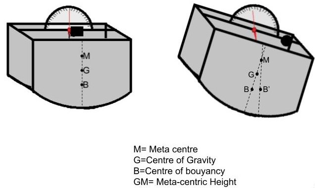

This folder has 
### Aim:  
To determine the meta-centric height of a given ship model. 
### Theory  
<ul><li>Whenever a body, floating in a liquid is given a small angular displacement, it starts oscillating about some point, this point about which the body starts oscillating is called Meta Centre.</li>
<li>A point from which the weight of a body or system may be considered to act is known as Centre of gravity.</li>
<li>The distance between the center of gravity of a floating body and the meta centre is called meta-centric height.</li></ul> 
As a matter of fact the meta-centric height of a floating body is a direct measure of its stability or in other words more the metacentric height of a floating body more it will be stable. A body is said to be in equilibrium when it remains in a steady state, while floating in a liquid. Following are the three conditions of equilibrium of a floating body: 
&emsp;&emsp;&emsp;&emsp;1.Stable equilibrium 
&emsp;&emsp;&emsp;&emsp;2.Unstable equilibrium  
&emsp;&emsp;&emsp;&emsp;3.Neutral equilibrium  
<b>STABLE EQUILIBRIUM:</b> A body is said to be in a stable equilibrium if it returns back to its original position when given a small angular displacement. This happens when the meta centre is higher than the center of gravity of the floating body. 
 
<b>UNSTABLE EQUILIBRIUM :</b> A body is said to be in an unstable equilibrium if it does not return back to its original position and heels further away when given a small angular displacement. This happens when the meta centre is lower than the center of gravity of the floating body. 
  
<b>NEUTRAL EQUILIBRIUM:</b> A body is said to be in a Neutral Equilibrium if it occupies a new position and remains rest in this new position when given a small angular displacement. This happens when the meta centre coincides with the centre of gravity of the floating body. 
  
  
  
 

  

 Consider a ship floating in water as shown in figure. If slight angular displacement is given to the floating body in the clockwise direction, the centre of buoyancy shifts from B to B’ such that the line of action of force of buoyancy, Fb  through B’ cuts the axis at M, which is called the meta-centre and the distance GM is called the meta-centric height. The buoyant force Fb through B’ and weight w through G constitute a couple acting in anti-clockwise direction and thus bringing the floating body in the original position. 
To determine the meta-centric height of a floating body, we know the centre of gravity of floating body. Place the known movable weight (w) over the centre of the body.  
The weight w is moved across the vessel towards right through a distance x. The body will be tilted. The angle of tilt &theta; is measured by means of plumb line and a protractor attached on the body. The new centre of gravity of the body will shift to G’ as the weight w has been moved towards the right. The centre of buoyancy will change to B’ as the body has tilted. Under equilibrium, the moment caused by the movement of the load w through a distance x must be equal to the moment caused by the shift of the centre of gravity from G to G’. Thus: 
		The moment due to change of G= (GG’ * W) = (W * GM tan &theta;) 
		The moment due to movement of w = (w * x) 
		Therefore,        (w * x) = W GM tan &theta; 
         
		Hence,             GM = (w*x)/(W* tan &theta;) 
			&emsp; &emsp; &emsp;Where,  
			&emsp; &emsp; &emsp; &emsp;w= applied weight. 
			&emsp; &emsp; &emsp; &emsp;W= Weight of ship=8.55kg (assumed). 
			&emsp; &emsp; &emsp; &emsp;x= distance at which weight is applied. 
			&emsp; &emsp; &emsp; &emsp;&theta; = angle of heel. 

### Procedure  
<ol><li>The first screen of the simulator contains the labelled experimental set-up to make the user well aware with the experimental set-up.</li>
<li>After the user clicks the next button, an empty tank containing the ship model is shown. The use will click on the drain pipe to close it and will again click on the inlet pipe to open the inlet valve to fill the tank with water. Click on the NEXT button.</li>
<li>The tank gets filled with water and the boat floats in the water. The user will click on the movable weight to apply the weight on the ship. Click on the NEXT button.</li>
<li>In the next screen user will observe that the boat got tilted with some angle &theta; due to the application of the weight. User will observe this angle of tilt and note it for the calculation of the meta-centric height. (Simulator provides few fixed values for angle of tilt based upon the real experimental data). Click on the NEXT button.</li>
<li>On the next screen, a table to take input values by the user will be shown. The user will enter the values for applied weight and distance of weight applied. Based upon these values, the simulator will display the value of angle of tilt.</li>
<li>On the NEXT screen, a standard data for calculating meta-centric height and an observation table will be shown. The user needs to calculate the meta-centric height depending upon the provided values and check their answer with that of the simulator.</li></ol> 
### Pre Test  
Q1. A point from which the weight of the body may be considered to act is known as: 
<b>a) Centre of gravity </b>
b) Meta Centre 
c) Centre of Bouyancy 
d) none of these 

Q2. Formula to calculate the meta-centric height (GM)? 
a) (W * x)/(w * tan &theta;) 
<b> b)(w * x)/(W * tan &theta;)</b> 
c) (x * tan &theta;)/(x * W) 
d) (W * tan &theta;)/(w * x) 

Q3. The angle of tilt of a ship: 
a) Is independent of weight applied. 
b)Is independent of distance at which weight is applied. 
<b>c) Depends on both, weight applied and distance at which weight is applied. </b> 
d) None of the above. 

### Post Test  
 
Q1. The premise of floatation of bodies is based on the premise of: 
&emsp;a) Centre of gravity 
&emsp;<b>b) Meta Centre</b> 
&emsp;c) Centre of Bouyancy 
&emsp;d) none of these 
Q2. The meta-centric height is effected by the change in density? 
&emsp;a) Can't be Determined. 
&emsp;b) False 
&emsp;<b>c) True</b> 
&emsp;d) none of these 

Q3. For a completely immersed body, the meta-centric height is always zero. 
&emsp;<b>a) False </b>
&emsp;b) True 
&emsp;c) Can't be Determined 
&emsp;d) none of these 

### References  
A textbook of FLUID MECHANICS AND HYDRAULIC MACHINES by DR. R. K. BANSAL. 
